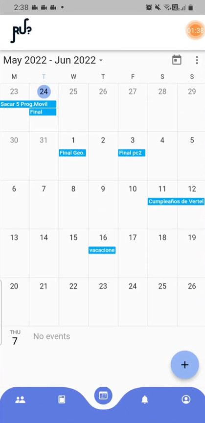

# 🎓 RU – Social App for University Students  

RU is a **mobile application** designed to help university students easily find campus events, connect with peers, and engage in a more active campus life.  

The app not only improved communication but also **boosted student engagement by 30%**, becoming a central tool for event participation and social interaction.  

---

## 📖 Project Overview
- 📱 Mobile-first app for student communities  
- 🎉 Find, create, and join university events  
- 👥 Social features: event participation & schedule sharing  
- 📍 Campus localization with Google Maps API  

---

## 🛠️ Tech Stack
- **Frontend & Backend (Cross-platform):** Flutter  
- **Database & Authentication:** Firebase (Firestore + Auth)  
- **Cloud Functions:** Firebase Functions for backend logic  
- **Maps & Localization:** Google Maps API  
- **Hosting & Deployment:** Firebase Hosting  

---

## 🏗️ Architecture
The RU application follows a **client–cloud architecture**:  
1. **Flutter app** (Android/iOS) handles UI, state management, and user interactions.  
2. **Firebase Firestore** stores event data, user schedules, and participation records in real time.  
3. **Firebase Authentication** manages user sign-in with email/university accounts.  
4. **Firebase Functions** process background tasks such as notifications and event updates.  
5. **Google Maps API** provides location-based event browsing and campus navigation.  

This stack was chosen to ensure **fast development**, **real-time synchronization**, and **scalability** for growing student communities.  

---

## 🚀 Key Achievements
- 🎓 Designed to enhance **university life** and peer-to-peer connections  
- 📈 Increased student engagement by **30%**  
- 👩‍💻 Led full-stack development of the entire application  
- 🏆 Positive impact recognized by students and faculty  

---

## 🎥 Demo Video
  

*(Click the image above to watch the demo)*  

---

## 📥 Explanation Video
👉 [Explanation video – latest changes](https://drive.google.com/file/d/1dHPtx_BzD78yUIM6gaL-_FNgpNcm9uEO/view?usp=sharing)  

---

## 👩‍💻 Team & Roles
- Led **full-stack development** (frontend + backend integration)  
- Collaborated with peers on UI/UX and feature testing  
- Focused on scalability and ease-of-use for student adoption  

---

## 🏆 Impact
RU showcased how student-driven innovation can transform campus life.  
By merging technology with real student needs, it created a platform that made participation in university activities more accessible, social, and engaging.  
